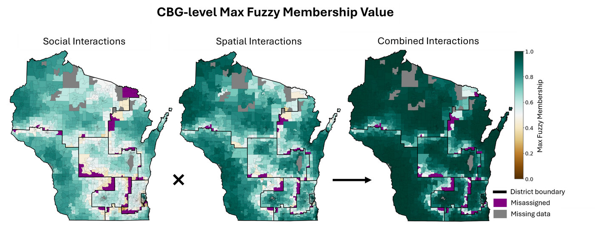
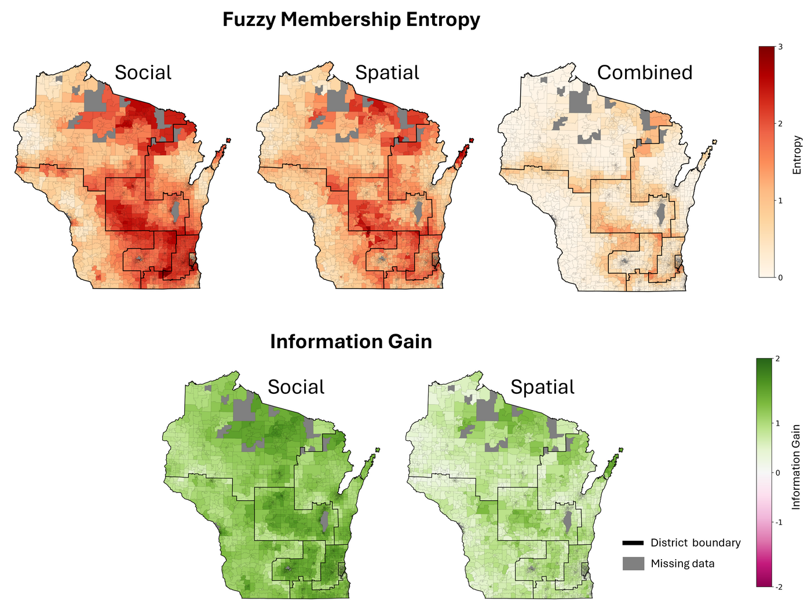

# fuzzy-membership

**Modeling region affiliation with fuzzy membership based on spatial and social interactions**

**Abstract:** A key challenge in regionalization is that regions, such as urban
function zones or climate zones, often have indeterminate boundaries, making it
difficult to exactly quantify their geographic extent. Political redistricting,
as a regionalization task, deals with this problem acutely, as requirements to
preserve communities of interest (COIs) do not define such communities,
introducing inherent vagueness in their boundaries. To address this issue, this
work introduces a network approach that models COIs by integrating
spatial-social interactions and evaluates district assignment by quantifying the
degree to which a geographic area is connected to all other areas within each
district. Furthermore, we draw on a splatial framework to understand the
different spaces in which modern human communities interact, allowing us to more
comprehensively model the community interactions that constitute COIs by using
both spatial and social interactions, as measured with human mobility flows and
social network connections. By comparing how district membership aligns across
these two interaction types with the fuzzy membership methodology, it can reveal
distinct spatial patterns, while combining them can reduce ambiguity in region
membership. To demonstrate its utility, the proposed methodology is applied to a
2020 congressional district plan for the State of Wisconsin. Beyond
redistricting, this work also contributes to the geography literature by
providing a spatial interaction-based framework for quantifying regional
affiliations in boundary areas.

*Key Words: fuzzy membership, redistricting, regionalization, spatial networks,
spatial-social interactions.*

## Paper

If you find this code useful for your research, you may cite our paper:

Kruse, J., Gao, S.*, and Mayer, K. R. (2025). [Modeling region affiliation with
fuzzy membership based on spatial and social interactions](https://doi.org/10.1080/24694452.2025.2551044).
Annals of the American Association of Geographers, 0(0), 1-23.

```bibtex
@article{kruse2025modeling,
  title={Modeling region affiliation with fuzzy membership based on spatial and social interactions},
  author={Kruse, Jacob and Gao, Song and Mayer, Kenneth R.},
  journal={Annals of the American Association of Geographers},
  volume={0},
  number={0},
  pages={1--23},
  year={2025},
  publisher={Taylor and Francis},
  doi={10.1080/24694452.2025.2551044}
}
```

You may also be interested in [WTRC](https://github.com/GeoDS/WTRC), which
identifies rich clubs in the same class of spatiotemporal interaction networks.

## What this package does

Given an interaction network over geographic areas and a plan assigning those
areas to regions, this package quantifies the degree to which each area is
connected to all other areas within each region — its **partial membership** in
that region.



*Maximum fuzzy membership value for each CBG, from social, spatial, and combined
interactions. Element-wise multiplication of fuzzy memberships for each CBG
produces much higher maximum membership values for most CBGs, showing that the
spatial and social interaction datasets tended to agree on their maximum
membership districts.*

Memberships built from spatial and social interactions can then be compared,
revealing distinct spatial patterns, or combined, reducing ambiguity in region
membership. The package computes the entropy of a membership distribution, the
information gain from combining perspectives, and the divergence between them,
and defuzzifies memberships to flag areas a plan places against the grain of
their own interactions.

## Install

```bash
git clone https://github.com/GeoDS/fuzzy-membership.git
cd fuzzy-membership
pip install .
```

The example notebook additionally uses geopandas and matplotlib, which come
with the `examples` extra:

```bash
pip install ".[examples]"
```

Requires Python 3.9+, numpy and pandas. Nothing else — the method is matrix
arithmetic, and no GIS stack is needed to compute memberships.

## Quickstart

```python
import geopandas as gpd

from fuzzy_membership import classify, combine, entropy, interaction_membership

# Areas with a district assignment, and a square interaction matrix over them.
cbgs = gpd.read_file("data/wi_cbgs_pmc_2020.gpkg").set_index("geoid")
districts = cbgs["district"]

spatial = interaction_membership(mobility_flows, districts, symmetrize=True)
social = interaction_membership(social_connections, districts)
combined = combine(spatial, social)

# Memberships come back indexed by area, so they map directly.
cbgs["entropy"] = entropy(combined)
cbgs["status"] = classify(combined, districts)["status"]

cbgs.plot(column="entropy", legend=True)
```

`interaction_membership` takes any square matrix over your areas — a numpy array,
or a DataFrame indexed by area id. Pass `symmetrize=True` for directed data such
as origin-destination flows, which folds in the interaction arriving from the
other direction; leave it off for data that is already symmetric, such as social
connectedness. If your interactions are held as a graph rather than a matrix, a
network library such as networkx can convert them to an adjacency matrix first.

[`examples/quickstart.ipynb`](examples/quickstart.ipynb) runs the whole
method over Wisconsin's block groups under the PMC congressional plan, from
loading the geometry through to the entropy and misassignment maps. The block
groups, their populations and their district assignments ship with the
repository in `data/wi_cbgs_pmc_2020.gpkg`; the interaction matrices are
simulated with an adaptive-bandwidth kernel over the block group centroids,
since the mobility and social data behind the published results cannot be
redistributed.

## Method

**Fuzzy membership.** An area's membership in a district is the share of its
interaction directed there:

$$\mu_{D_j}(x) = \frac{\sum_{y \in D_j} I_{xy}}{\sum_{k} \sum_{y \in D_k} I_{xy}}$$

for area $x$, district $D_j$, and interaction strength $I_{xy}$. Memberships sum
to one across districts. `region_membership` gives the district-level analogue,
aggregating areas into their districts first.

**Combination.** Membership sets built from spatial and social interactions are
combined element-wise and renormalized:

$$\mu_{D_j}^{\text{combined}}(x) = \frac{\mu_{D_j}^{\text{spatial}}(x) \cdot \mu_{D_j}^{\text{social}}(x)}{\sum_{k} \mu_{D_k}^{\text{spatial}}(x) \cdot \mu_{D_k}^{\text{social}}(x)}$$

This is `method="product"`, the default. Agreement between the two interaction
types amplifies a district's membership and disagreement suppresses it, reducing
ambiguity in region membership.

`method="mean"` takes the arithmetic mean instead. Note that averaging
cannot reduce ambiguity, since entropy is concave, so use the product if you are
measuring information gain.

**Entropy** measures how dispersed a membership is across districts, in bits:

$$H(x) = -\sum_j \mu_{D_j}(x) \log_2 \mu_{D_j}(x)$$

Zero for an area wholly inside one district, up to $\log_2 k$ for one split
evenly across all $k$.

**Information gain** is the entropy an interaction type sheds when combined,
$H^{\text{source}}(x) - H^{\text{combined}}(x)$; positive means combining gave a
clearer, less uncertain view of the area's district membership.



*Fuzzy membership entropy and information gain. The top row displays the entropy
of fuzzy membership values from social (left), spatial (center), and combined
(right) datasets; the combined map shows lower entropy, indicating a more
concentrated membership distribution across districts. The bottom row shows
information gain when using the combined membership instead of the individual
social (left) or spatial (right) memberships. Green shades represent areas where
entropy decreased, signifying information gain, while pink shades indicate
regions of entropy increase, signifying information loss.*

**KL divergence** compares those per-area distributions district by district,
showing where a single interaction type departs most from the combined view.

**Defuzzification.** `assign` gives each area the district it has the strongest
membership in. `classify` compares that against the plan and sorts areas into
four cases:

| status | meaning |
| --- | --- |
| `aligned` | the plan matches the strongest membership, at or above the threshold |
| `low_membership` | the plan matches, but the maximum membership is below the threshold (0.5 by default), so the area has a relatively weak affiliation with that district |
| `misassigned` | the strongest membership is in some other district |
| `no_interaction` | the area has no recorded interaction, so its memberships are all zero and say nothing about where it belongs |

## API

| Function | Purpose |
| --- | --- |
| `interaction_membership(interactions, labels)` | Area-by-district memberships |
| `region_membership(interactions, labels)` | District-by-district memberships |
| `combine(*memberships, method)` | Combine interaction types, by `"product"` or `"mean"` |
| `entropy(memberships)` | Per-area Shannon entropy |
| `information_gain(source, combined)` | Entropy shed by combining |
| `kl_divergence_by_region(source, combined, labels)` | Divergence between two perspectives, within each district |
| `assign(memberships)` | Strongest-membership district per area |
| `classify(memberships, labels)` | Areas sorted against a plan |

## Data

The published analysis used two interaction layers over Wisconsin census block
groups, neither of which is redistributable here:

- **Spatial** — human mobility flows from SafeGraph Neighborhood Patterns,
  scaled from device counts to population flows by
  $\text{Flows}_{od} \times \text{Pop}_o / \text{Devices}_o$.
- **Social** — social network connections from Meta's
  [Social Connectedness Index](https://data.humdata.org/dataset/social-connectedness-index),
  published at ZCTA level and apportioned to block groups by population share.

Any square interaction matrix over the same areas works in their place.

What does ship is `data/wi_cbgs_pmc_2020.gpkg`: the 4,678 Wisconsin census block
groups with their 2020 populations and their district under the People's Maps
Commission congressional proposal, with boundaries simplified to 300 m. Census
geometry and the PMC plan are both public.

## License

MIT — see [LICENSE](LICENSE).

Figures are from Kruse, Gao and Mayer (2025), *Annals of the American
Association of Geographers*.
